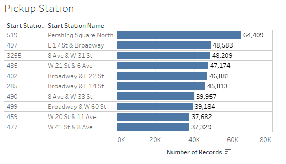
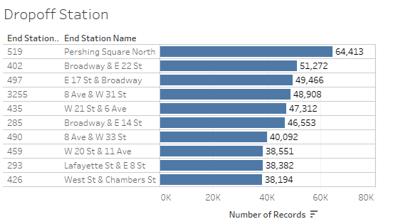
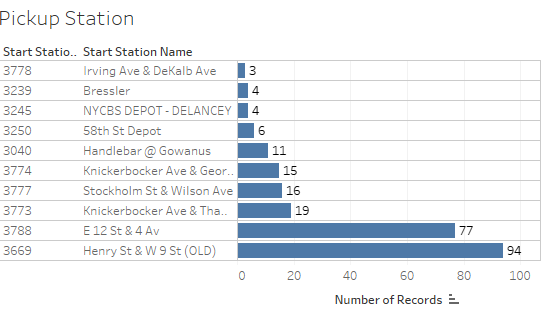
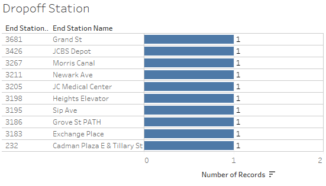
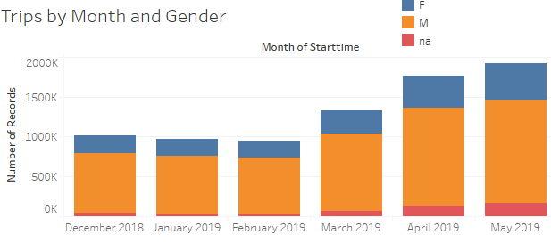
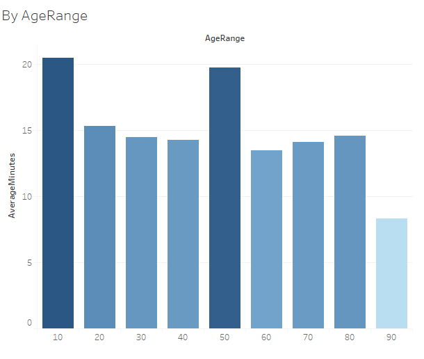

# wk20-tableau
* How many trips have been recorded total during the chosen period?
        7.5Mil
        I chose the trailing 6 months of the full csv files available. 

* By what percentage has total ridership grown? 
    from my first month of data vs the last month, dec18 v may19 there has been an 89% increase
* How has the proportion of short-term customers and annual subscribers changed?
    slightly, it looks like they %of short term customers increased slightly
* What are the peak hours in which bikes are used during summer months? 
    the peak hours for the all 6 months were 8am and 5pm
* What are the peak hours in which bikes are used during winter months?
    the peak hours for the all 6 months were 8am and 5pm
* Today, what are the top 10 stations in the city for starting a journey? (Based on data, why do you hypothesize these are the top locations?)
     Location, lower manhattan
* Today, what are the top 10 stations in the city for ending a journey? (Based on data, why?)
    , lower manhattan
* Today, what are the bottom 10 stations in the city for starting a journey? (Based on data, why?)
       Location, new jersey
* Today, what are th e bottom 10 stations in the city for ending a journey (Based on data, why?)
    , location is spuradic
* Today, what is the gender breakdown of active participants (Male v. Female)?
    , constomer base seems strongly male
* How effective has gender outreach been in increasing female ridership over the timespan?
    in the last 6months of data there has been a slight increase
* How does the average trip duration change by age?
    
* What is the average distance in miles that a bike is ridden?
there is distance between points but that is not exactly distance
* Which bikes (by ID) are most likely due for repair or inspection in the timespan? 

* How variable is the utilization by bike ID?

What I did notice was that subscribers take shorter more frequent bike rides. 
